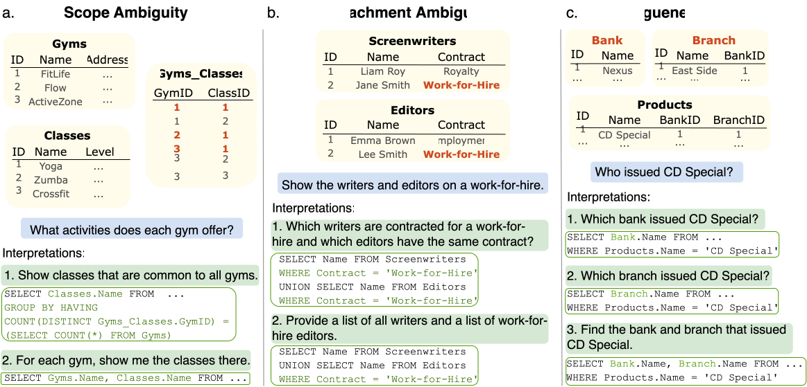

# AMBROSIA

AMBROSIA is a new benchmark for recognizing and interpreting ambiguous requests in text-to-SQL. The dataset contains questions with three types of ambiguity (scope ambiguity, attachment ambiguity, and vagueness), their interpretations, and corresponding SQL queries. AMBROSIA and all released software are distributed under [CC BY 4.0](https://creativecommons.org/licenses/by/4.0/deed.en).

This repository contains data and code used for data collection and evaluation.




## Data
The dataset is available at [ambrosia-benchmark.github.io](https://ambrosia-benchmark.github.io/). Please download and extract it into the `data` directory.

## Setup
To speed up inference, we use various toolkits: [TGI](https://github.com/huggingface/text-generation-inference), [VLLM](https://github.com/vllm-project/vllm), and [OpenChat server](https://github.com/imoneoi/openchat). These libraries can be easily accessed using Docker. To run Docker, first build and run the custom image (it will install additional packages and copy data to the base image):

```
docker build -t <image_name> -f <Dockerfile> .
docker run -it <image_name> <args_for_base_image> /bin/bash
```

Dockerfiles for TGI, OpenChat and VLLM inference are available in the [docker](docker/) directory.

Build and run the customized TGI image (for Llama3 and CodeLlama *Prompt*):

```bash
docker build -t ambrosia-docker-image-tgi -f docker/Dockerfile_tgi .
docker run -it ambrosia-docker-image-tgi --gpus all \
    --shm-size 1g \
    --env "HUGGING_FACE_HUB_TOKEN=<secret>" \
    --model-id $model \
    --max-best-of '1' \
    /bin/bash
```

Build and run the customized VLLM image (for Llama3, CodeLlama and OpenChat *Beam*):

```bash
docker build -t ambrosia-docker-image-vllm -f docker/Dockerfile_vllm .
docker run -it ambrosia-docker-image-vllm --runtime nvidia --gpus all \
    --shm-size 1g \
    --env "HUGGING_FACE_HUB_TOKEN=<secret>" \
    --model $model \
    --max-model-len 5120 \
    --seed 1 \
    /bin/bash
```

Build and run the customized OpenChat image (for OpenChat *Prompt* and database generation):

```bash
docker build -t ambrosia-docker-image-openchat -f docker/Dockerfile_openchat .
docker run -it ambrosia-docker-image-openchat --gpus all /bin/bash
```

## Evaluation
All evaluation functions are located in the `src/evaluation` directory. Prompts for evaluations can be found in `src/prompts/evaluation`. 
Scripts for the experiments are provided in `src/scripts`. For example, to perform zero-shot inference of Llama3-70B with the *Prompt* method (requires TGI):
```bash
./src/scripts/zero_shot_prompt.sh "meta-llama/Meta-Llama-3-70B-Instruct" --tgi
```

You can also run inference directly (with a fixed random seed and only ambiguous questions):
```bash
python src/evaluation/evaluate_model_tgi.py \
    --prompt_file src/prompts/evaluation/prompt \
    --use_tgi \
    --api_url 'http://0.0.0.0/' \
    --model_name "meta-llama/Meta-Llama-3-70B-Instruct" \
    --type_of_questions ambig
```

For example, to perform zero-shot inference of Llama3-70B with the Beam method (requires VLLM):
```bash
./src/scripts/zero_shot_beam_vllm_server.sh "meta-llama/Meta-Llama-3-70B-Instruct"
```

Or to run inference directly (with a fixed random seed and only ambiguous questions):
```bash
python3 src/evaluation/evaluate_model_openai_api.py  \
    --prompt_file src/prompts/evaluation/beam \
    --use_vllm \
    --api_url 'http://localhost:8000/v1' \
    --api_key 'EMPTY' \
    --model_name "meta-llama/Meta-Llama-3-70B-Instruct" \
    --type_of_questions ambig
```


## Database Generation
All evaluation functions are located in the `src/db_generation` directory. Prompts for evaluations can be found in `src/prompts/db_generation`. Domains are specified in the data directory. We use the [OpenChat](https://huggingface.co/openchat/openchat-3.5-0106) model for database generation. 

Once you run a Docker container with OpenChat, you can run the generation of key concepts and relations:

```bash
./src/scripts/generate_key_concepts_relations.sh
```

It will run the following command for all ambiguity types:
```bash
python src/db_generation/generate_key_concepts_relations.py --prompt_file PROMPT --ambig_type AMBIG_TYPE --data_dir DIR_FOR_CONCEPTS --domain_file DOMAIN_FILE --api_url "http://localhost:18888/v1/"
```

Run database generation:

```bash
./src/scripts/generate_databases.sh
```

It will run the following command for all ambiguity types:
```bash
python src/db_generation/generate_databases.py --data_dir data/ --ambig_type AMBIG_TYPE --api_url "http://localhost:18888/v1/"
```


## Data Collection Interface

You can find the [Potato](https://potato-annotation.readthedocs.io/en/latest/) interface for data collection in the `annotation` directory. To install Potato, follow the instructions in the [README](annotation/README.md). We use the [modified version](https://github.com/cohere-ai/human-feedback-paper/tree/main/interface/prolific) written by Hosking et al., 2024.

To start Potato, run the following command:
```bash
cd annotation/
python potato/flask_server.py start ambrosia_data_collection/configs/CONFIG_FILE -p 8000
```

The config options are: 
- [scope_questions_interpretations.yaml](annotation/ambrosia_data_collection/configs/scope_questions_interpretations.yaml): annotation of questions with scope ambiguity and their interpretations;
- [attachment_questions_interpretations.yaml](annotation/ambrosia_data_collection/configs/attachment_questions_interpretations.yaml): annotation of questions with attachment ambiguity and their interpretations;
- [vague_questions_sql.yaml](annotation/ambrosia_data_collection/configs/vague_questions_sql.yaml): annotation of vague questions and SQL queries (provided for databases with general concepts, see paper for more details);
- [vague_interpretations.yaml](annotation/ambrosia_data_collection/configs/vague_interpretations.yaml): annotation of interpretations for vague questions;
- [database_review.yaml](annotation/ambrosia_data_collection/configs/database_review.yaml): validation of generated concepts and databases.

We provide examples of raw data in  ```annotation/ambrosia_data_collection/data_files```.
Instructions for annotators can be found in  ```annotation/ambrosia_data_collection/instructions```

## Paper

More details on data collection and evaluation results are provided in the paper:
> [𝔸𝕄𝔹ℝ𝕆𝕊𝕀𝔸: A Benchmark for Parsing Ambiguous Questions into Database Queries](https://arxiv.org/abs/2406.19073)
> 
> Irina Saparina and Mirella Lapata
